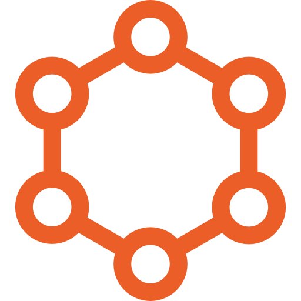
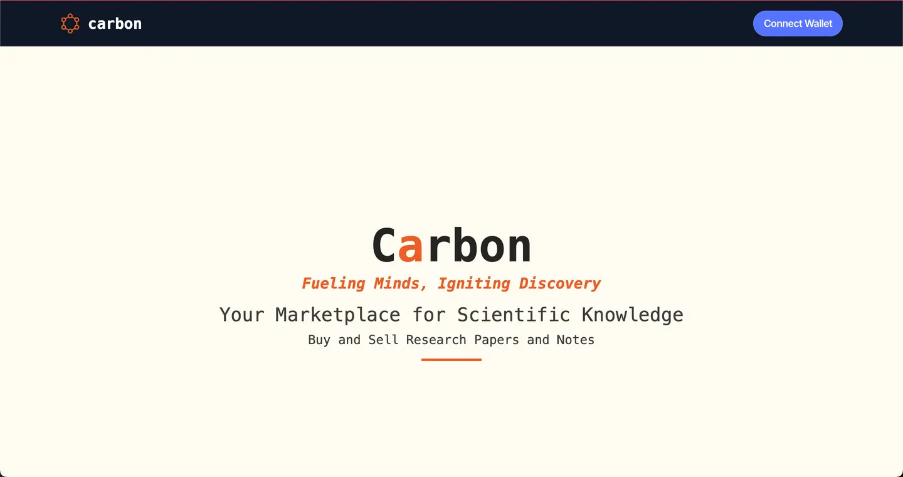

#  Carbon: Decentralized Scientific Data Marketplace

## Overview



Carbon is a decentralized platform for sharing, selling, and purchasing scientific datasets using blockchain technology. Built on Polygon and utilizing Filecoin for storage, Carbon aims to revolutionize how researchers access and monetize scientific data.

## Smart Contract

[Smart Contract](https://amoy.polygonscan.com/address/0x713b5173E4C01330D9d93f97810480ABEFEA87Ce)

## Slides

[Slides](https://www.canva.com/design/DAGNMp-fO5E/TMqb_qSqj76yWxDi6yXq-A/view?utm_content=DAGNMp-fO5E&utm_campaign=designshare&utm_medium=link&utm_source=editor)

Key Features:

- Decentralized data storage using Filecoin
- Smart contracts on Polygon for transactions and access control
- NFT representation of datasets
- Peer-review system for data verification
- User-friendly marketplace interface

## Tech Stack

- Frontend: Next.js, React
- Styling: Tailwindcss, Flowbite, Shadcn
- Smart Contracts: Solidity
- Blockchain: Polygon
- Storage: Filecoin/IPFS
- Wallet Connnect: Wagmi, Wallet Connect
- Authentication: Web3 wallets (e.g., MetaMask)

## Local Setup

To set up the project locally, follow these steps:

1. Clone the repository:

   ```
   git clone https://github.com/4rjunc/carbon.git
   cd carbon
   ```

2. Install dependencies:

   ```
   npm install
   ```

3. Create a `.env.local` file in the root directory and add necessary environment variables:

   ```
   NEXT_PUBLIC_POLYGON_RPC_URL=your_polygon_rpc_url
   NEXT_PUBLIC_FILECOIN_API_KEY=your_filecoin_api_key
   ```

4. Run the development server:

   ```
   npm run dev
   ```

5. Open [http://localhost:3000](http://localhost:3000) in your browser to see the application.

## Smart Contract Deployment

1. Install Hardhat (if not already included in project dependencies):

   ```
   npm install --save-dev hardhat
   ```

2. Compile contracts:

   ```
   npx hardhat compile
   ```

3. Deploy to Polygon testnet (Mumbai):
   ```
   npx hardhat run scripts/deploy.js --network mumbai
   ```

Remember to update the deployed contract address in your `.env.local` file.

## Contributing

We welcome contributions to the Carbon project! Please read our CONTRIBUTING.md file for guidelines on how to make contributions.

## License

This project is licensed under the MIT License - see the LICENSE.md file for details.
